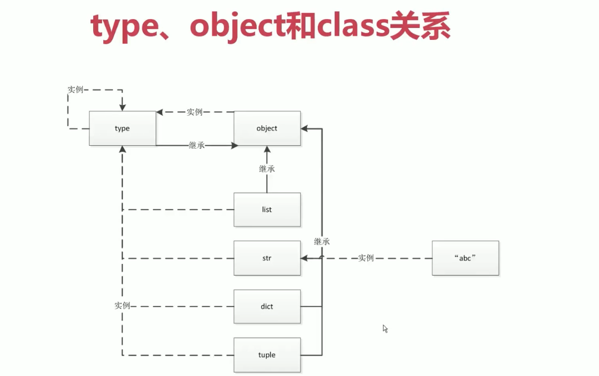

## 元类

在 `Pyhton` 程序中，元类犹如一把利刃，使用得当能让框架开发者的代码更加优雅，调用更加便捷，而对于广大的应用层开发人员，元类设计不当，就会给代码引入不可预料的隐患，所以最好选择其他替代方案。

虽说应尽量避免使用元类，但也正是因为如此倒是勾起了我们探索的好奇心，下面一起来研究下元类的使用和 `Python` 实现元类的机理。

先通过下面两个实例，实际感受下 `metaclass` 到底能做什么。

## 单例模式

```python
class Singleton(type):
    def __init__(self, *args, **kwargs):
        self.__instance = None
        super().__init__(*args, **kwargs)

    def __call__(self, *args, **kwargs):
        if self.__instance is None:
            self.__instance = super().__call__(*args, **kwargs)
            return self.__instance
        else:
            return self.__instance


# Example
# Python3
class Spam(metaclass=Singleton):
    def __init__(self):
        print('Creating Spam')

# Python2
# class Spam(Object):
#     __metaclass__ = Singleton
```

上述代码是通过元类实现的单例模式，对于调用者是使用方便的，而且完美的支持继承。示例：

```shell
>>> a = Spam()
Creating Spam
>>> b = Spam()
>>> a is b
True
>>> c = Spam()
>>> a is c
True
>>>
```

也许你可能提出质疑，实现单例模式的方法很多，使用元类的优势在哪，这个问题在可以参见[这里](https://stackoverflow.com/questions/6760685/creating-a-singleton-in-python)。
对比其他的方式，元类的解决方案会更加优雅，代码更加清晰。

## YAML load 函数的实现

先看到下面的实例代码：

```python
class Monster(yaml.YAMLObject):
  yaml_tag = u'!Monster'

  def __init__(self, name, hp, ac, attacks):
    self.name = name
    self.hp = hp
    self.ac = ac
    self.attacks = attacks

  def __repr__(self):
    return "%s(name=%r, hp=%r, ac=%r, attacks=%r)" % (
       self.__class__.__name__, self.name, self.hp, self.ac,
       self.attacks)


monster1 = yaml.load("""
--- !Monster
name: Cave spider
hp: [2,6]    # 2d6
ac: 16
attacks: [BITE, HURT]
""", Loader=yaml.Loader)
print(type(monster1))
print(monster1)
print(yaml.dump(Monster(name='Cave spider', hp=[2, 6], ac=16, attacks=['BITE', 'HURT'])))

# output
<class '__main__.Monster'>

Monster(name='Cave spider', hp=[2, 6], ac=16, attacks=['BITE', 'HURT'])

!Monster
ac: 16
attacks:
- BITE
- HURT
hp:
- 2
- 6
name: Cave spider
```

可以看到，`Monster` 类只是简单的继承了类 `yaml.YAMLObject` 之后，`yaml.load` 就可以自动将 `yaml` 的配置序列化成 `Python` 类了，这个设计使用简单，调用者完全没有任何冗余的转换代码 ，而 `yaml.dump` 也是在没有提前获取任何关于 `Monster` 类信息的情况下对 `Monster` 进行逆序列化。

那么如此强大的功能是怎么实现的呢？可以在 `yaml` 的 [源码](https://github.com/yaml/pyyaml/blob/0f64cbfa54b0b22dc7b776b7b98a7cd657e84d78/lib3/yaml/__init__.py#L364) 中找到答案。

```python
# 以下省略了无关代码
class YAMLObjectMetaclass(type):
    def __init__(cls, name, bases, kwds):
        super(YAMLObjectMetaclass, cls).__init__(name, bases, kwds)
        if 'yaml_tag' in kwds and kwds['yaml_tag'] is not None:
            cls.yaml_loader.add_constructor(cls.yaml_tag, cls.from_yaml)

class YAMLObject(metaclass=YAMLObjectMetaclass):
    yaml_loader = Loader
    @classmethod
    def from_yaml(cls, loader, node):
        return loader.construct_yaml_object(node, cls)

class BaseConstructor:
    @classmethod
    def add_constructor(cls, tag, constructor):
        if not 'yaml_constructors' in cls.__dict__:
            cls.yaml_constructors = cls.yaml_constructors.copy()
        cls.yaml_constructors[tag] = constructor
```

从以上源码可以看到：

- 面向使用者的是 `YAMObject` ，其元类被设置为自定义的 `YAMLObjectMetaclass`
- 完成用户类 `Monster` 的定义后，就会初始化元类 `YAMLObjectMetaclass`
- `Loader` 继承自 `BaseConstructor` ，而类方法 `add_constructor` 用于绑定 `tag` 和 类信息
- `YAMLObjectMetaclass` 判断到 `Monster` 是否拥有类属性 `yaml_tag` ，如果有就将 `yaml_tag` 和 `Monster` 这个类进行绑定，之后 `load` 时再根据 `tag` 索引到类信息，进行序列化。

## 元类的实现机理

接下来从以下四点来说明进行说明。

### 一切皆对象

`Python` 中所有类都继承自 `object` ，且所有的类都是 `type` 类的实例对象，当然也包括 `type` 本身。

```python
>>> issubclass(type, object)
True
```

`type` 、`class` 和 `object` 具体的关系图如下：



### 所有的用户类都是 `type` 类的对象

其实从上图已经能画出来了，所有的类都是对象，而且是 `type` 这个类的对象。

```python
>>> class Test:
...     pass
...
>>> type(Test)
<class 'type'>
>>> type(Test())
<class '__main__.Test'>
```

这里补充说明下，`type()` 有两个功能，当接收的参数只有一个时，返回类实例（传入的参数）所属的类，当接收的参数是三个时，返回的是一个新的 `type` 对象。[HELP](https://docs.python.org/3/library/functions.html#type)

### 创建类的过程实际上只不过是 `type` 类的 `__call__` 运算符重载

当我们定义一个类的时候，真正发生的事情是 `Python` 调用 `type` 的 `__call__` 运算符。而 `__call__` 运算符则进一步调用 `__new__` 和 `__init__` 。下面 show you code ，代码中两种创建类的方式是完全等效的。

```python
# 常规方法创建类
>>> class Test1:
...     data = 1
...
>>> instance1 = Test1()
>>> Test1, instance1, instance1.data
(<class '__main__.Test1'>, <__main__.Test1 object at 0x7fd528071630>, 1)

# 通过 type 创建类
>>> Test2 = type('Test2', (), {'data': 1})
>>> instance2 = Test2()
>>> Test2, instance2, instance2.data
(<class '__main__.Test2'>, <__main__.Test2 object at 0x7fd528083748>, 1)
```

### 所有自定义元类都继承 `type`

当我们为某个类指定 `metacalss` 后，创建类的过程会变成如下代码所示：

```python
class = type(name, bases, dict)
# 变成
class = MyMetaclass(name, bases, dict)
```

上述 `YAMl` 的示例中，我们的 `YAMLObject` 类指定元类为 `YAMLObjectMetaclass` ，所以当代码运行到 `Monster` 的定义时，就会在 `YAMLObjectMetaclass` 的 `__init__` 函数中偷偷进行注册。

## 代码地址

[https://github.com/Jacksonlike/blog_code/tree/master/metaclass](https://github.com/Jacksonlike/blog_code/tree/master/metaclass)

## 参考文档

[Python Cookbook](https://python3-cookbook.readthedocs.io/zh_CN/latest/c09/p13_using_mataclass_to_control_instance_creation.html)

[Python 进阶:metaclass 谈](https://www.lizenghai.com/archives/15015.html)

[Python 一切皆对象](http://www.langzi.fun/Python%E4%B8%80%E5%88%87%E7%9A%86%E5%AF%B9%E8%B1%A1.html)
